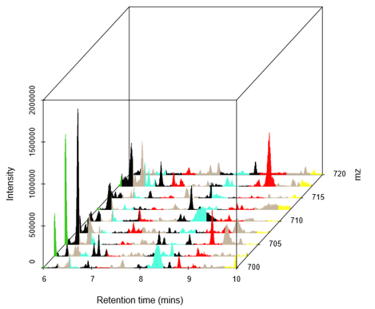
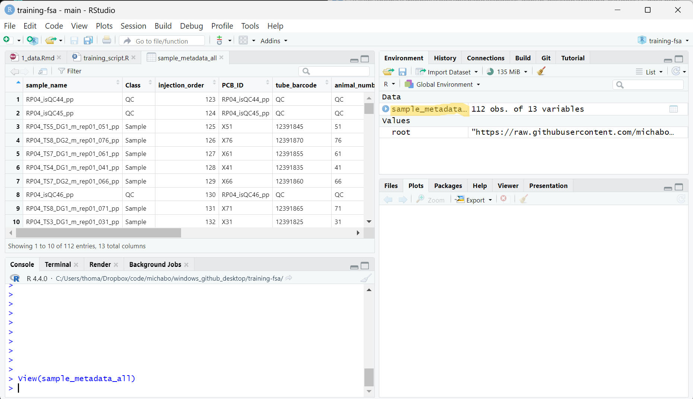

```{r setup, include=FALSE}
knitr::opts_chunk$set(echo = TRUE)
```

# Cefic MATCHING metabolomics data set 


The tutorial will use data generated as part of the **Cefic MATCHING study**. the Its aim was to conduct a blinded international ring trial to investigate whether six metabolomics labs, each generating, analysing and reporting metabolomics data from a single exposure study (rodent plasma), would independently arrive at the same grouping hypothesis [@viant2024demonstrating].

{width=300px}
Rather than using all the data from the Cefic MATCHING study, this tutorial will focus only on metabolomics data obtained from sampling the plasma of **male** rats and the processed mass spectrometry data obtained from a single ring trial labs (**Phenome Centre Birmingham**).


{width=300px}

&nbsp;

# Liquid chromatography mass spectrometry assays

Mass spectrometry coupled liquid chromatography (in particular high-resolution mass spectrometry with Ultra-high-performance liquid chromatography - UHPLC-MS) is an effective and popular approach for metabolomics and is what was used for obtaining the data we are using for this tutorial.

Full details of the methods are found in the supplemental materials of the Cefic MATCHING publication
 [supplemental of Cefic MATCHING publication](https://www.ncbi.nlm.nih.gov/pmc/articles/PMC10944399/bin/204_2024_3680_MOESM1_ESM.pdf) [@viant2024demonstrating].

The UHPLC−MS approach used for our dataset consisted of four assays, comprising two types of chromatography and two mass spectrometry ionisation modes (positive and negative). The chromatographic columns were either a Hydrophilic Interaction Liquid “HILIC” column (primarily to measure polar metabolites) or a C18 column (primarily to measure lipids). These data types are labeled in the following way:

* HILIC_POS
* HILIC_NEG
* LIPIDS_POS
* LIPIDS_NEG

This tutorial focuses only on one assay (**HILIC_POS**) for most of the steps in order to make the data analysis more manageable.

The raw data collected from these LC-MS assays generally have three dimensions.

* **Retention time (RT)**: This is the time at which the metabolites are eluted from the chromatography column based on the physiochemical properties of the metabolite.
* **Mass-to-charge ratio (m/z)**: To obtain m/z, the metabolites have been ionised into gas-phase, then separated and detected by the mass spectrometer.
* **Intensity**: The intensity of each m/z is proportional to the number of ions detected.However, without reference standards, intensity cannot accurately by used to quantify the concentration of metabolites due to various confounding factors (e.g., ion suppression).


{width=400px}

&nbsp;

# Sample metadata
Let’s begin with looking at the metadata for the samples to understand the dataset better.

All files for this practical are downloaded directly from the Github repository. See the root URL below.

```{r root_dir_url}
root <- 'https://raw.githubusercontent.com/michabohealthscience/omics-grouping-training/main'
```

If you are using data downloaded locally, please change the root variable to the path where the data are located.

The sample metadata is stored in a comma-separated text file (.csv). We can read this file into R using the read.csv function and by specifying the URL path to the ‘.csv’ file. This will save the metadata as a dataframe R object.


```{r root_dir, echo=FALSE}
root <- '.'
```


If you are using data downloaded locally, please change the root variable to the path where the data are located.

The sample metadata is stored in a comma-separated text file (.csv). We can read this file into R using the `read.csv` function and by specifying the URL path to the ‘.csv’ file. This will save the metadata as a `dataframe` R object.

```{r sample_metadata}
sample_metadata_all <- read.csv(file.path(root, 'data/HILIC_POS_male/0_sample_metadata.csv'))
```

Let’s have a quick look at the sample metadata. We can use the `head` function just to see the first few rows.

```{r sample_metadata_view}
head(sample_metadata_all)

```
&nbsp;
&nbsp;


If we look in the RStudio **Environment** panel and click on `sample_metadata_all` data object, we can see a more user friendly view of the data where you can filter columns. Alternatively you can run `View(sample_metadata_all)`.


&nbsp;
&nbsp;


The following information regarding the independent variables for each sample was available to the metabolomics labs prior to unblinding:


* **Test substances**: TS1, TS2, TS3, TS4, TS5, TS7, TS8, TS9
* **Doses**: Low (1), High (2)
* **Sex**: Male

(TS = Test Substance; TS6 was excluded before exposures).

It is important to note that there are Quality Control (QC) samples throughout the run. We will touch briefly on this later. All other samples are distributed randomly across the run to help counteract any drift effects across the UHPLC−MS run.

For each test substance and dose, there are 5 biological replicates (i.e. 5 samples for each experimental treatment) and 1 technical replicate for each sample.

The ‘prep order’ refers to the preparation of the samples (i.e., metabolite extraction). Like with the run order, the preparation order was randomized across the samples to help counteract any confounding variable effects that may bias the results of the experiment.


# How big is the dataset?

When we combine all the assays (HILIC_POS, HILIC_NEG, LIPIDS_POS, LIPID_NEG) for the male component of the data, we are analysig 28,664 metabolite features across 90 samples so… 28,664 x 90 = 2,579,760 data points!


# References {-}


